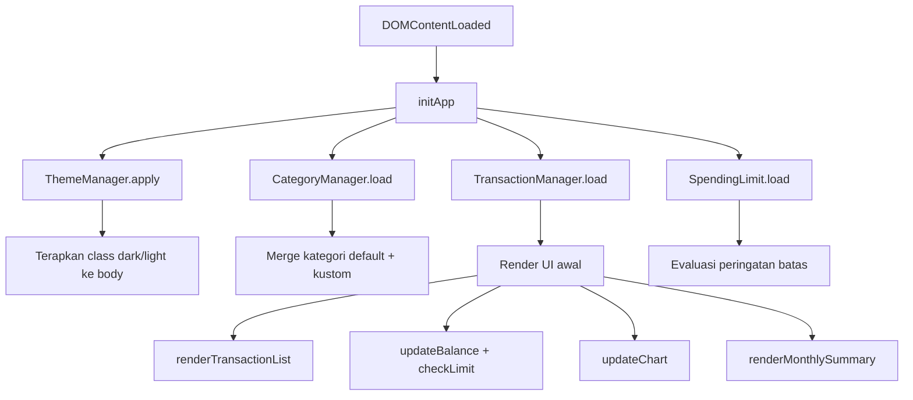

# Dokumen Desain Teknis: Expense & Budget Visualizer Enhanced

## Ikhtisar

Dokumen ini menjabarkan desain teknis untuk peningkatan aplikasi Expense & Budget Visualizer yang sudah ada. Tujuh fitur baru ditambahkan ke arsitektur vanilla JavaScript yang sudah ada tanpa mengubah fondasi teknologi (HTML5, CSS3, Chart.js).

### Prinsip Desain

- **Backward Compatible**: Semua data yang sudah tersimpan di localStorage tetap valid
- **Incremental Enhancement**: Setiap fitur baru ditambahkan sebagai lapisan di atas arsitektur yang ada
- **Single File**: Semua logika tetap di `js/app.js`, semua style di `css/styles.css`
- **No New Dependencies**: Tidak ada library tambahan selain Chart.js yang sudah ada

### Stack Teknologi

- HTML5, CSS3 (CSS Custom Properties untuk theming)
- Vanilla JavaScript ES6+ (class-based)
- Chart.js (sudah ada)
- `Intl.NumberFormat('id-ID')` untuk format Rupiah
- localStorage API untuk semua persistensi

## Arsitektur

### Struktur Komponen yang Diperbarui

```
┌─────────────────────────────────────────────────────────┐
│                    index.html (View)                    │
│  ┌──────────────────────────────────────────────────┐   │
│  │  Header: [Judul]  [Toggle Dark/Light Mode]       │   │
│  └──────────────────────────────────────────────────┘   │
│  ┌──────────────────────────────────────────────────┐   │
│  │  Balance Section + Spending Limit Warning        │   │
│  └──────────────────────────────────────────────────┘   │
│  ┌──────────────────────────────────────────────────┐   │
│  │  Form: Item | Jumlah (Rp) | Kategori (+ kustom)  │   │
│  └──────────────────────────────────────────────────┘   │
│  ┌──────────────────────────────────────────────────┐   │
│  │  Kategori Kustom Manager                         │   │
│  └──────────────────────────────────────────────────┘   │
│  ┌──────────────────────────────────────────────────┐   │
│  │  Spending Limit Input                            │   │
│  └──────────────────────────────────────────────────┘   │
│  ┌──────────────────────────────────────────────────┐   │
│  │  Sort Controls + Transaction List                │   │
│  └──────────────────────────────────────────────────┘   │
│  ┌──────────────────────────────────────────────────┐   │
│  │  Monthly Summary (nav prev/next + tabel)         │   │
│  └──────────────────────────────────────────────────┘   │
│  ┌──────────────────────────────────────────────────┐   │
│  │  Pie Chart                                       │   │
│  └──────────────────────────────────────────────────┘   │
└─────────────────────────────────────────────────────────┘
                          │
                          ▼
┌─────────────────────────────────────────────────────────┐
│                    js/app.js (Logic)                    │
│  StorageManager  (tidak berubah)                        │
│  TransactionManager  + getSortedTransactions()          │
│                      + getMonthlyTransactions()         │
│  CategoryManager  (baru)                                │
│  ThemeManager     (baru)                                │
│  ChartManager     (tidak berubah)                       │
│  UIManager        + renderSortControls()                │
│                   + renderMonthlySummary()              │
│                   + updateSpendingLimit()               │
│                   + updateCategoryOptions()             │
└─────────────────────────────────────────────────────────┘
                          │
                          ▼
┌─────────────────────────────────────────────────────────┐
│                   localStorage                          │
│  'transactions'       → Array<Transaction>              │
│  'customCategories'   → Array<string>                   │
│  'spendingLimit'      → number | null                   │
│  'theme'              → 'dark' | 'light'                │
└─────────────────────────────────────────────────────────┘
```

### Alur Data



## Komponen dan Antarmuka

### 1. StorageManager (Tidak Berubah)

Kelas ini sudah generik dan tidak memerlukan perubahan. Semua key baru (`customCategories`, `spendingLimit`, `theme`) menggunakan instance `StorageManager` terpisah.

### 2. TransactionManager (Diperluas)

Tambahan dua metode baru:

```javascript
class TransactionManager {
  // ... metode yang sudah ada ...

  /**
   * Kembalikan transaksi yang sudah diurutkan.
   * @param {'amount'|'category'|'date'} sortBy
   * @param {'asc'|'desc'} order
   * @returns {Array<Transaction>}
   */
  getSortedTransactions(sortBy = 'date', order = 'desc') { }

  /**
   * Kembalikan transaksi yang dikelompokkan per bulan-tahun.
   * @returns {Map<string, { transactions: Array, total: number, count: number }>}
   *   Key format: 'YYYY-MM'
   */
  getMonthlyTransactions() { }
}
```

**Logika `getSortedTransactions`**:
- `sortBy = 'date'`, `order = 'desc'`: urutkan berdasarkan `timestamp` terbaru di atas (default)
- `sortBy = 'amount'`: urutkan berdasarkan `amount`
- `sortBy = 'category'`: urutkan berdasarkan `category` secara alfabetis
- Tidak mengubah array `this.transactions` asli (gunakan `[...this.transactions].sort(...)`)

**Logika `getMonthlyTransactions`**:
- Iterasi semua transaksi, ekstrak `YYYY-MM` dari `timestamp`
- Akumulasi `total` (sum amount) dan `count` per key
- Kembalikan Map yang sudah diurutkan dari terbaru ke terlama

### 3. CategoryManager (Baru)

```javascript
class CategoryManager {
  static DEFAULT_CATEGORIES = ['Food', 'Transport', 'Fun'];
  static STORAGE_KEY = 'customCategories';

  constructor(storageManager) { }

  /** Muat kategori kustom dari localStorage. */
  load() { }

  /**
   * Tambah kategori kustom baru.
   * @returns {{ success: boolean, error?: string }}
   */
  addCategory(name) { }

  /**
   * Hapus kategori kustom.
   * @returns {{ success: boolean, error?: string }}
   */
  removeCategory(name) { }

  /**
   * Kembalikan semua kategori (default + kustom).
   * @returns {Array<string>}
   */
  getAllCategories() { }

  /** Kembalikan hanya kategori kustom. */
  getCustomCategories() { }
}
```

**Aturan Validasi `addCategory`**:
- Nama tidak boleh kosong atau hanya whitespace
- Nama tidak boleh duplikat (case-insensitive check terhadap semua kategori)
- Simpan ke localStorage setelah berhasil

### 4. ThemeManager (Baru)

```javascript
class ThemeManager {
  static STORAGE_KEY = 'theme';
  static DARK_CLASS = 'theme-dark';

  constructor(storageManager) { }

  /** Muat dan terapkan tema dari localStorage saat init. */
  load() { }

  /**
   * Toggle antara dark dan light.
   * Simpan preferensi ke localStorage.
   */
  toggle() { }

  /** Kembalikan tema aktif saat ini. @returns {'dark'|'light'} */
  getCurrent() { }
}
```

**Implementasi**:
- Tambah/hapus class `theme-dark` pada `document.body`
- CSS transition `150ms` ditangani oleh CSS (`transition: background-color 150ms, color 150ms`)
- Default: `'light'` jika tidak ada preferensi tersimpan

### 5. UIManager (Diperluas)

Tambahan metode baru:

```javascript
class UIManager {
  // ... metode yang sudah ada ...

  /**
   * Render kontrol pengurutan (dropdown sort by + toggle asc/desc).
   * Dipanggil sekali saat init.
   */
  renderSortControls() { }

  /**
   * Render ringkasan bulanan untuk bulan yang sedang aktif.
   * @param {string} monthKey - Format 'YYYY-MM'
   */
  renderMonthlySummary(monthKey) { }

  /**
   * Evaluasi dan tampilkan/sembunyikan peringatan batas pengeluaran.
   * Highlight saldo merah jika balance > spendingLimit.
   */
  updateSpendingLimit() { }

  /**
   * Perbarui opsi <select> kategori dengan semua kategori (default + kustom).
   */
  updateCategoryOptions() { }

  /**
   * Format angka ke format Rupiah.
   * @param {number} amount
   * @returns {string} contoh: "Rp 1.500.000"
   */
  formatRupiah(amount) { }
}
```

**Implementasi `formatRupiah`**:
```javascript
formatRupiah(amount) {
  return new Intl.NumberFormat('id-ID', {
    style: 'currency',
    currency: 'IDR',
    minimumFractionDigits: 0,
    maximumFractionDigits: 0
  }).format(amount);
  // Output: "Rp 1.500.000"
}
```

## Perubahan HTML (index.html)

### Elemen Baru yang Perlu Ditambahkan

```html
<!-- 1. Header dengan toggle tema (sebelum balance-section) -->
<header class="app-header">
  <h1 class="app-title">Expense & Budget Visualizer</h1>
  <button id="theme-toggle" class="btn btn--icon" aria-label="Toggle dark/light mode">
    <span class="theme-icon">🌙</span>
  </button>
</header>

<!-- 2. Spending Limit (di dalam atau setelah balance-section) -->
<div class="spending-limit-section">
  <label for="spending-limit-input">Batas Pengeluaran (Rp)</label>
  <div class="spending-limit-controls">
    <input type="number" id="spending-limit-input" min="0" step="1000"
           placeholder="Contoh: 5000000" />
    <button id="set-limit-btn" class="btn btn--secondary">Tetapkan</button>
  </div>
  <p id="spending-limit-warning" class="spending-warning" hidden>
    ⚠️ Pengeluaran melebihi batas!
  </p>
</div>

<!-- 3. Kategori Kustom Manager (setelah form-section) -->
<section class="custom-category-section" aria-label="Kelola Kategori Kustom">
  <h2 class="section-title">Kategori Kustom</h2>
  <div class="custom-category-controls">
    <input type="text" id="new-category-input" placeholder="Nama kategori baru"
           maxlength="50" />
    <button id="add-category-btn" class="btn btn--secondary">Tambah</button>
  </div>
  <ul id="custom-category-list" class="custom-category-list"></ul>
</section>

<!-- 4. Sort Controls (di dalam transactions-section, sebelum ul) -->
<div class="sort-controls" id="sort-controls">
  <label for="sort-by">Urutkan:</label>
  <select id="sort-by">
    <option value="date">Terbaru</option>
    <option value="amount">Jumlah</option>
    <option value="category">Kategori</option>
  </select>
  <button id="sort-order-btn" class="btn btn--icon" aria-label="Toggle urutan">↑↓</button>
</div>

<!-- 5. Monthly Summary (setelah transactions-section) -->
<section class="monthly-summary-section" aria-label="Ringkasan Bulanan">
  <h2 class="section-title">Ringkasan Bulanan</h2>
  <div class="monthly-nav">
    <button id="prev-month-btn" class="btn btn--icon" aria-label="Bulan sebelumnya">‹</button>
    <span id="current-month-label" class="month-label"></span>
    <button id="next-month-btn" class="btn btn--icon" aria-label="Bulan berikutnya">›</button>
  </div>
  <div id="monthly-summary-content" class="monthly-summary-content"></div>
</section>
```

### Perubahan pada Elemen yang Ada

- `<html lang="en">` → `<html lang="id">`
- `<title>` → `Expense & Budget Visualizer`
- Label `Amount ($)` → `Jumlah (Rp)`
- Input amount: hapus `step="0.01"`, ganti `min="1"`, hapus `placeholder="0.00"` → `placeholder="0"`
- `<p class="balance-amount" id="balance-display">$0.00</p>` → nilai diisi JS dengan format Rupiah
- Tambah `<option value="Makanan">Makanan</option>` dst. atau pertahankan English, sesuai keputusan

## Perubahan CSS (css/styles.css)

### Variabel CSS Baru untuk Dark Mode dan UI Modern

```css
:root {
  /* === Warna Modern (Light Mode) === */
  --color-primary:        #6366f1;   /* indigo lebih hidup */
  --color-primary-hover:  #4f46e5;
  --color-accent:         #f59e0b;   /* amber accent */
  --color-gradient-start: #6366f1;
  --color-gradient-end:   #8b5cf6;

  /* Bayangan lebih dalam */
  --shadow-sm:  0 2px 8px rgba(0,0,0,0.08);
  --shadow-md:  0 8px 24px rgba(0,0,0,0.12);
  --shadow-lg:  0 16px 40px rgba(0,0,0,0.16);

  /* Radius lebih besar */
  --radius-md:  12px;
  --radius-lg:  20px;

  /* Transisi tema */
  --transition-theme: 150ms ease;

  /* Spending limit warning */
  --color-warning:    #f59e0b;
  --color-warning-bg: #fffbeb;
  --color-danger:     #ef4444;
  --color-danger-bg:  #fef2f2;
}

/* === Dark Mode Variables === */
body.theme-dark {
  --color-bg:           #0f172a;
  --color-surface:      #1e293b;
  --color-text:         #f1f5f9;
  --color-text-muted:   #94a3b8;
  --color-border:       #334155;
  --color-balance-bg:   #1e293b;
  --color-balance-text: #e2e8f0;
  --color-primary:      #818cf8;
  --color-primary-hover:#6366f1;
  --shadow-sm:  0 2px 8px rgba(0,0,0,0.3);
  --shadow-md:  0 8px 24px rgba(0,0,0,0.4);
}

/* Transisi tema pada elemen utama */
body {
  transition:
    background-color var(--transition-theme),
    color var(--transition-theme);
}
```

### Class CSS Baru

```css
/* Header */
.app-header { display: flex; justify-content: space-between; align-items: center; }

/* Balance warning state */
.balance-amount.balance--warning { color: var(--color-danger); }

/* Spending limit */
.spending-warning { color: var(--color-danger); font-weight: 600; }

/* Sort controls */
.sort-controls { display: flex; align-items: center; gap: var(--space-sm); margin-bottom: var(--space-md); }

/* Monthly summary */
.monthly-nav { display: flex; align-items: center; justify-content: center; gap: var(--space-md); }
.month-label { font-weight: 600; min-width: 140px; text-align: center; }
.monthly-summary-content { /* tabel atau card ringkasan */ }

/* Custom category list */
.custom-category-list { list-style: none; display: flex; flex-wrap: wrap; gap: var(--space-sm); }
.custom-category-tag { display: inline-flex; align-items: center; gap: var(--space-xs);
  background: var(--color-balance-bg); border-radius: 999px;
  padding: var(--space-xs) var(--space-sm); font-size: var(--font-size-sm); }

/* Icon button */
.btn--icon { min-height: 44px; min-width: 44px; padding: var(--space-xs); }
.btn--secondary { background: transparent; border: 1px solid var(--color-primary);
  color: var(--color-primary); }
```

## Model Data

### Transaction (Tidak Berubah)

```javascript
{
  id: string,        // timestamp-random
  itemName: string,  // 1-100 karakter
  amount: number,    // bilangan bulat positif (Rupiah, tanpa desimal)
  category: string,  // default atau kustom
  timestamp: number  // Date.now()
}
```

### CustomCategories

```javascript
// localStorage key: 'customCategories'
// Value: JSON array of strings
["Kesehatan", "Pendidikan", "Hiburan"]
```

### SpendingLimit

```javascript
// localStorage key: 'spendingLimit'
// Value: JSON number atau null
5000000  // Rp 5.000.000
```

### Theme

```javascript
// localStorage key: 'theme'
// Value: JSON string
"dark" | "light"
```

### State Aplikasi (In-Memory)

```javascript
{
  transactions: Array<Transaction>,
  customCategories: Array<string>,
  spendingLimit: number | null,
  theme: 'dark' | 'light',
  currentSortBy: 'date' | 'amount' | 'category',
  currentSortOrder: 'asc' | 'desc',
  currentMonthKey: string  // 'YYYY-MM'
}
```

## Properti Kebenaran (Correctness Properties)

*Sebuah properti adalah karakteristik atau perilaku yang harus berlaku di semua eksekusi valid sistem — pada dasarnya, pernyataan formal tentang apa yang seharusnya dilakukan sistem. Properti berfungsi sebagai jembatan antara spesifikasi yang dapat dibaca manusia dan jaminan kebenaran yang dapat diverifikasi mesin.*

### Properti 1: Format Rupiah Konsisten

*Untuk semua* angka positif, fungsi `formatRupiah` harus menghasilkan string yang dimulai dengan "Rp" dan menggunakan titik sebagai pemisah ribuan.

**Memvalidasi: Persyaratan 2.1, 2.3**

### Properti 2: Input Bilangan Bulat Diterima, Desimal Ditolak

*Untuk semua* bilangan bulat positif, `addTransaction` harus menerimanya. Untuk semua input yang bukan bilangan bulat positif (negatif, nol, desimal yang tidak dibulatkan ke integer), `addTransaction` harus menolaknya.

**Memvalidasi: Persyaratan 2.5**

### Properti 3: Round-Trip Kategori Kustom

*Untuk semua* daftar nama kategori kustom yang valid, jika disimpan ke localStorage dan dimuat kembali, daftar yang dimuat harus identik dengan daftar asli.

**Memvalidasi: Persyaratan 3.2, 3.6**

### Properti 4: Kategori Kustom Muncul di Semua Pilihan

*Untuk semua* kategori kustom yang ditambahkan, kategori tersebut harus muncul di dropdown form input dan di data chart.

**Memvalidasi: Persyaratan 3.3, 3.4**

### Properti 5: Validasi Nama Kategori Kustom

*Untuk semua* nama kategori yang kosong, hanya whitespace, atau sudah ada (duplikat), `CategoryManager.addCategory` harus mengembalikan `{ success: false }` dan tidak mengubah daftar kategori.

**Memvalidasi: Persyaratan 3.5**

### Properti 6: Pengelompokan Bulanan Akurat

*Untuk semua* daftar transaksi dengan timestamp acak, `getMonthlyTransactions` harus mengelompokkan transaksi dengan benar berdasarkan bulan-tahun, dengan total dan jumlah yang tepat untuk setiap kelompok.

**Memvalidasi: Persyaratan 4.2, 4.3**

### Properti 7: Pengurutan Ascending dan Descending Adalah Kebalikan

*Untuk semua* daftar transaksi, hasil `getSortedTransactions(field, 'asc')` harus merupakan kebalikan urutan dari `getSortedTransactions(field, 'desc')`.

**Memvalidasi: Persyaratan 5.4**

### Properti 8: Urutan Default adalah Terbaru di Atas

*Untuk semua* daftar transaksi dengan timestamp berbeda, `getSortedTransactions('date', 'desc')` harus mengembalikan transaksi dengan timestamp terbesar di posisi pertama.

**Memvalidasi: Persyaratan 5.5**

### Properti 9: Peringatan Batas Pengeluaran

*Untuk semua* kombinasi saldo dan batas pengeluaran, jika saldo > batas maka status peringatan harus aktif; jika saldo ≤ batas maka status peringatan harus tidak aktif.

**Memvalidasi: Persyaratan 6.2, 6.4, 6.5**

### Properti 10: Round-Trip Batas Pengeluaran

*Untuk semua* nilai batas pengeluaran yang valid, jika disimpan ke localStorage dan dimuat kembali, nilai yang dimuat harus identik dengan nilai asli.

**Memvalidasi: Persyaratan 6.3, 6.6**

### Properti 11: Round-Trip Preferensi Tema

*Untuk semua* nilai tema ('dark' atau 'light'), jika disimpan ke localStorage dan dimuat kembali, tema yang diterapkan harus identik dengan tema yang disimpan.

**Memvalidasi: Persyaratan 7.3, 7.4**

## Penanganan Error

### Error Validasi Kategori Kustom

- Nama kosong/whitespace: `"Nama kategori tidak boleh kosong"`
- Nama duplikat: `"Kategori '${name}' sudah ada"`
- Nama terlalu panjang (>50 karakter): `"Nama kategori maksimal 50 karakter"`

### Error Batas Pengeluaran

- Nilai negatif: `"Batas pengeluaran harus berupa angka positif"`
- Nilai bukan angka: `"Masukkan angka yang valid"`

### Error Validasi Jumlah (Rupiah)

- Nilai desimal: dibulatkan ke integer terdekat atau ditolak dengan pesan `"Jumlah harus berupa bilangan bulat"`
- Nilai nol atau negatif: `"Jumlah harus lebih dari 0"`

### Fallback localStorage

Semua operasi localStorage dibungkus dalam try-catch melalui `StorageManager` yang sudah ada. Jika localStorage tidak tersedia, aplikasi berjalan dalam mode in-memory.

## Strategi Pengujian

### Pendekatan Ganda

Strategi pengujian menggunakan dua pendekatan yang saling melengkapi:
- **Unit test**: Memverifikasi contoh spesifik, kasus tepi, dan kondisi error
- **Property test**: Memverifikasi properti universal di semua input yang mungkin

### Unit Testing

**Framework**: Jest

**Contoh kasus uji**:
- `formatRupiah(1500000)` → `"Rp 1.500.000"`
- `formatRupiah(0)` → `"Rp 0"`
- `CategoryManager.addCategory('')` → `{ success: false }`
- `CategoryManager.addCategory('Food')` → `{ success: false }` (duplikat)
- `ThemeManager.toggle()` dua kali → kembali ke tema awal
- Ringkasan bulan tanpa transaksi → menampilkan pesan kosong

### Property-Based Testing

**Framework**: fast-check

**Konfigurasi**: Minimum 100 iterasi per property test

**Generator**:

```javascript
// Generator transaksi valid (amount integer)
const transactionArb = fc.record({
  id: fc.string({ minLength: 1 }),
  itemName: fc.string({ minLength: 1, maxLength: 100 }),
  amount: fc.integer({ min: 1, max: 100_000_000 }),
  category: fc.constantFrom('Food', 'Transport', 'Fun'),
  timestamp: fc.integer({ min: 0 })
});

// Generator nama kategori valid
const categoryNameArb = fc.string({ minLength: 1, maxLength: 50 })
  .filter(s => s.trim().length > 0);

// Generator tema
const themeArb = fc.constantFrom('dark', 'light');
```

**Property Tests**:

```javascript
// Properti 1: Format Rupiah
// Feature: expense-budget-visualizer-enhanced, Property 1: Format Rupiah Konsisten
fc.assert(fc.property(fc.integer({ min: 0, max: 1_000_000_000 }), (amount) => {
  const result = formatRupiah(amount);
  return result.startsWith('Rp') && !result.includes(',');
}), { numRuns: 100 });

// Properti 3: Round-Trip Kategori Kustom
// Feature: expense-budget-visualizer-enhanced, Property 3: Round-Trip Kategori Kustom
fc.assert(fc.property(fc.array(categoryNameArb, { minLength: 1, maxLength: 10 }), (names) => {
  const storage = new StorageManager('customCategories');
  storage.save(names);
  const result = storage.load();
  return JSON.stringify(result.data) === JSON.stringify(names);
}), { numRuns: 100 });

// Properti 7: Ascending adalah kebalikan Descending
// Feature: expense-budget-visualizer-enhanced, Property 7: Pengurutan Ascending dan Descending Adalah Kebalikan
fc.assert(fc.property(fc.array(transactionArb, { minLength: 2 }), (transactions) => {
  const manager = new TransactionManager(mockStorage);
  manager.transactions = transactions;
  const asc = manager.getSortedTransactions('amount', 'asc');
  const desc = manager.getSortedTransactions('amount', 'desc');
  return JSON.stringify(asc) === JSON.stringify([...desc].reverse());
}), { numRuns: 100 });

// Properti 9: Peringatan Batas Pengeluaran
// Feature: expense-budget-visualizer-enhanced, Property 9: Peringatan Batas Pengeluaran
fc.assert(fc.property(
  fc.integer({ min: 0, max: 10_000_000 }),
  fc.integer({ min: 1, max: 10_000_000 }),
  (balance, limit) => {
    const shouldWarn = balance > limit;
    const result = evaluateSpendingWarning(balance, limit);
    return result.isWarning === shouldWarn;
  }
), { numRuns: 100 });
```

### Pengujian Manual

Diperlukan untuk:
- Verifikasi visual dark/light mode (kontras, keterbacaan)
- Animasi transisi tema 150ms
- Responsivitas pada 320px
- Aksesibilitas (keyboard navigation, screen reader)
- Kompatibilitas browser (Chrome, Firefox, Edge, Safari)
